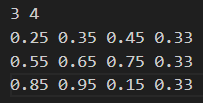
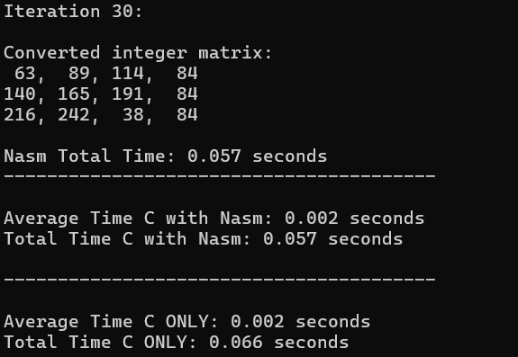
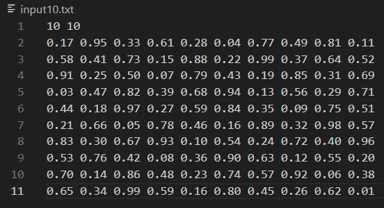
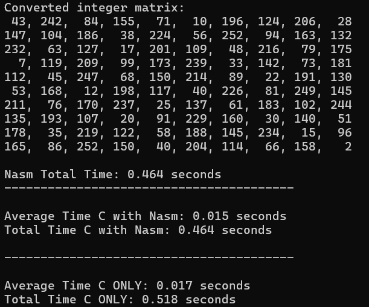

# LBYARCH MCO2

By Francisco, Zachary Mitchell P.

Limtin, Richard Jeremy S.

S20A

Specs: Grayscale (imgCvtGrayDoubleToInt)

## Video
https://drive.google.com/file/d/1t-DSBVIob6q0_xKAotwWCATtvkwYDM7H/view?usp=sharing

## Program Input and Output

### Specs Example

### 10x10 Example

## Results (in seconds)
### 10x10
NASM + C, Average = 0.015

NASM + C, Total = 0.463

C Only, Average = 0.014

C Only, Total = 0.430

### 100x100
NASM + C, Average = 1.525

NASM + C, Total = 45.751

C Only, Average = 1.499

C Only, Total = 44.975

### 500x500
NASM + C, Average = 27.352

NASM + C, Total = 820.546

C Only, Average = 27.693

C Only, Total = 830.795

### Explanation
Assembly language through NASM hypothetically runs a faster code because the programmer has control over every CPU instruction. However, C compilers, such as GCC uses high optimization levels that generates code slightly slower, or in some cases, slightly faster. A possibility for this is the compiler's ability to do global optimizations in large code blocks and schedule instructions to keep the CPU's pipeline full. Additionally, the compilers have the ability to maximize cache hits and makign efficient memory access than simply reducing instruction count.